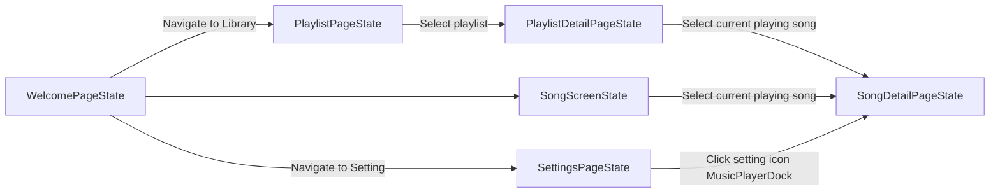
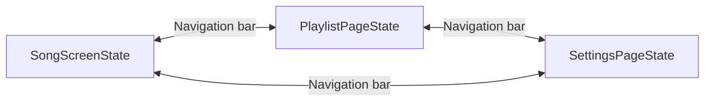
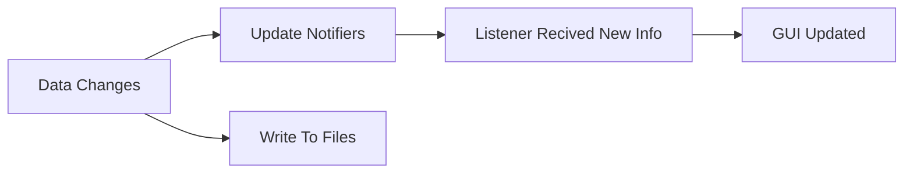

# Flutter Music Player

## 1. Project Overview
This project is aimed to create a freely distributed music player app (and, also my chance of practicing), with NO ADS, NO SUBSCRIPTIONS and NO COLLECTING PERSONAL INFORMATION TO SELL*. 

Everything start with the lib directory (where the source code live). One minor item: to find the apk, check the ```build/app/outputs/flutter-apk``` directory. 

Current supported and tested platform: Windows/Android. 
Will never be supported: any apple product. Reason: I refuse to pay any anual fees whatsoever. No subscription.  

- *Collecting information*: None. Read the android manifest in ```android/app/src/main/res```. I don't even ask for internet access.

- *Legal information*: This project is distributed under the **GNU License**. See the `LICENSE` file in the repository for full details of this freedom and other legal details.

## 2. Preparation
This section guides you through setting up a local development environment for the project.

**Prerequisites & Installation**

To run this project, ensure you have **Flutter SDK** and **git** installed, and properly set up.  

Install the dependencies and set up Flutter engine accordingly before cloning. Failure to set up the flutter engine for your device and, correspondingly, on the device that you would like to run the project on, say, developing on Windows and run on Android, will make you unable to run the project. 

After setting up (```flutter doctor -v``` report that you can at least run on your current device), do the following to clone and run the project. 

```bash
git clone https://github.com/dp0812/music_player_flutter.git
cd music_player_flutter
flutter pub get
flutter run lib/main.dart
```

Note: specifically for Linux system, for example, I am using CachyOS, there might be an error that looks like this if you run the application in debug mode.  

```bash
PlatformException(LinuxAudioError, Unknown GstGError. See details., Your GStreamer installation is missing a plug-in. (Domain: gst-core-error-quark, Code: 12), null)
```

Then please try to download the package accordingly. 

For CachyOS (Arch based):
```bash
sudo pacman -Syu gst-plugins-base gst-plugins-good gst-plugins-bad gst-plugins-ugly gst-libav
```

For Debian based: 
```bash
sudo apt update
sudo apt install gstreamer1.0-plugins-base gstreamer1.0-plugins-good gstreamer1.0-plugins-bad gstreamer1.0-plugins-ugly
```

For Fedora based: I do not have a fedora device. But perhaps just change the package manager to dnf and hope that it works. 


To compile binaries for testing on an android device: 

```bash
flutter clean 
flutter build apk --split-per-abi
flutter build apk
```
Use clean to delete the old build first. 

The second option build a fat apk that is compatible with all abi, while the first option you MUST choose the correct abi, else it will be trigger a warning of "this application does not support the latest android, please contact the dev" or something similar. 


## 3. Pipeline Overview
This section is to assist whoever wants to read and understand what is going on with this project. I will provide a high level overview of the work pipeline in the project. 

**Overall Workflow**
1.  **Init**: 
- On app start, ```main.dart``` will request permission (if running device is android) and initialize the AudioService as well as SongControlsManager (this is for controlling the song playback). 
- Then after all this is done, the app will initialize the pages. 
    1. Due to the logic of each pages mostly reside in their state, I will refer to the pages by their state name and skip the non state version. That is, WelcomePageState means the welcome page, and vice versa. 
    2. All pages has the MusicPlayerDock, which will be carry around for controlling playback. Think of this dock as a front end for the function of SongControlsManager.  
    3. Navigation: the SongDetailPageState has a back button (or, use the back gesture on phone) that allows the user to go back to the page they navigate to SongDetailPageState. This apply for all pages that may interact with SongDetailPageState (be it clicking on the playing song, or using the MusicPlayerDock). 

2.  **Pages**:
- Visualization of the pages navigation (high level).



- Note that one can easily navigate from and to the 3 direct child of WelcomePageState using the navigation bar, as follows: 



Bellow are the description of each pages with more detail explanation. 

- WelcomePageState:
    - Provide the navigation bar to navigate to other pages. In this project, these are the direct child pages: SongScreenState (default starting page), PlaylistPageState and SettingState.
    - Provide each of its direct child pages the SongControlsManager and AudioService for controlling playback and other functions (such as highlighting the current playing song).
- SongScreenState (direct child of WelcomePageState):
    - Contains the full list of song object, and other functionality (refer to the code). A song that is removed by using the GUI in this page will similarly be removed from the PlaylistPageState, but it does not work the other way around, unless in the case that said song is removed by DELETING THE FILE on the device.
    - Can be navigate to using the bottom navigation bar.
- PlaylistPageState (direct child of WelcomePageState):
    - Contain a list of song playlist, and other functionality to manipulate playlist. 
    - Can be navigate to using the bottom navigation bar, or by returning from the PlaylistDetailPageState. 
- SettingPageState (direct child of WelcomePageState):
    - Contains the preset theme and project info.  
    - Can be navigate to using the bottom navigation bar.
- PlaylistDetailPageState (direct child of PlaylistPageState):
    - Contains song list of the playlist, and other functionality to manipulate this list. 
    - Can be navigate to by clicking on the playlist item from PlaylistPageState. 
- SongDetailPageState: 
    - Contains the detail of a song (metadata, art, etc) and other functionality. 
    - This will be updated if the current playing song change. 
    - Can be navigate to by clicking on the current playing song (this will be highlighted by the GUI), or expanding the MusicPlayerDock and clicking on the setting symbols in the dock.  

3.  **Processing Data && Storage**: 
- Song are extracted from .mp3 files (1), and data is written to file, inside the folder specified by the result of getApplicationDocumentsDirectory method. 
This varies across different os. Please check the terminal output to see where this file is. 
    - (1): For now, even though the underlying logic also support the playing of .wav, .m4a files, I set the filter to not fetch them.
- The program does not store the file - it only stores the access path. 
- The logic of loading and saving songs is mainly in the SongRepository and SongSaver, both are classes designed to be used statically. 

4.  **GUI**: 
- All things about GUI are located in the ui_components folder. 
- Updating the GUI based on the notifier - listener mechanism. Think of this like a set state, except for the fact that we limit the rebuild to just a specific component that we wrap the builder around. 
    - For example: If the song progress change (every single miliseconds), then the progress bar needs to be updated to reflect this. But there is no need to update the song list (since we add no new song) and also no need to update the app bar (the buttons on the app bar still do the same thing). This is the rationale for updating the GUI using value listenable builder/listenable builder.


